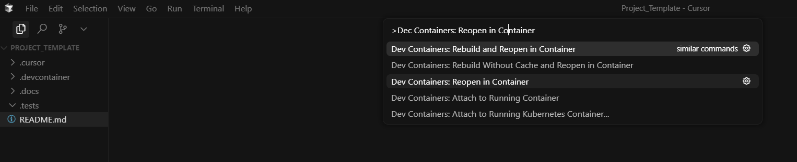

# Cursor Project Template

A simple template to help you start new projects with Cursor AI and development containers.

## Prerequisites

Make sure you have these installed on your computer:

- **Cursor** (or Visual Studio Code) - your code editor
- **Dev Container extension** - adds container support to your editor
- **Docker Desktop** - must be installed and running

## Getting Started

### 1. Create Your Project
1. Copy this entire folder to a new location on your computer
2. **Remove the `.git` folder** - This ensures you start with a clean git history for your new project
3. Rename the folder to whatever you want to call your project
4. Open the folder in Cursor or VS Code

### 2. Start the Development Environment
1. Press `Ctrl+Shift+P` (Windows/Linux) or `Cmd+Shift+P` (Mac) to open the command palette
2. Type "Dev Containers: Rebuild Container" and press Enter
3. Wait for the setup to complete (this may take a few minutes the first time)

### 3. Tell AI About Your Project
1. Open the file `.docs/Initial_Prompt.md`
2. Write down what you want to build and any specific requirements
3. The AI will help you set up and develop your project

## Important Information

**Don't delete or move these folders** - they're needed for the template to work:
- `.docs/` - project documentation and AI prompts
- `.cursor/` - Cursor-specific settings
- `.devcontainer/` - development container configuration
- `.tests/` - testing setup

These folders are automatically hidden from version control, so you don't need to worry about them.

## Important Note

**If you're using Visual Studio Code instead of Cursor**: Change the `.cursor/` folder name to `.vscode/` for proper VS Code integration.

## Troubleshooting

If something isn't working:

1. **Docker Desktop**: Make sure it's running (and has been run at least once before)
2. **Extensions**: Check that the Dev Container extension is installed in your editor
3. **Container Issues**: Try rebuilding the container from the command palette
4. **Still Stuck?**: Check the Docker Desktop logs or restart your editor

---

